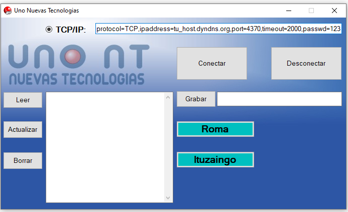

<h1 align="center">Sincronización de dispositivos ZKteco</h1>

  

Este código es una integracón para actualizar y sincronizar bases de datos de diferentes dispositivos "ZK Teco" (biométricos,lectores de huellas, de acceso magnético, etc).
Este proyecto especificamente contiene un formulario para manejar 2 bases de datos mysql que se corresponden con 2 cocheras, con administración independiente pero gestionadas desde una única terminal.
El proyecto fue realizado en el año 2017 por lo que es probable que algunas librerias esten obsoletas.

## Videos

